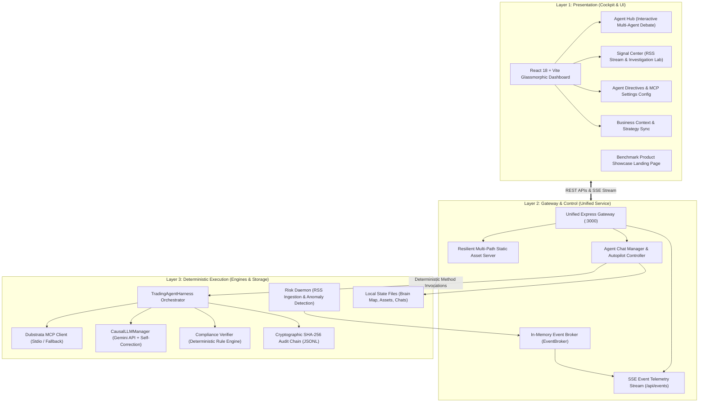

# ⚡ Strata: Geopolitical Situation Monitor & Multi-Agent Hub

[](https://github.com/MuzikayiseKhuzwayo/dubstrata-investigation/blob/main/LICENSE)
[](https://www.typescriptlang.org/)
[](https://nodejs.org/)
[](https://modelcontextprotocol.io/)
[](#-automated-verification)

**Strata** is an enterprise-grade situation workstation that fuses real-time geopolitical and macroeconomic news feeds, causal graph knowledge traversal via the **Dubstrata MCP** standard, deterministic copywriting compliance verification, and an autonomous multi-agent operational debate room.

```
                          ┌──────────────────────────┐
                          │   Live RSS News Feeds    │
                          └─────────────┬────────────┘
                                        │
                                        ▼
                          ┌──────────────────────────┐
                          │  Background Risk Daemon  │ <─── [Screens Macro/Geopolitical Threats]
                          └─────────────┬────────────┘
                                        │ (Critical Anomaly)
                                        ▼
                          ┌──────────────────────────┐
                          │    Agent Hub Session     │ <─── [Autonomously Spawns Debate]
                          └─────────────┬────────────┘
                                        │
                                        ▼
                          ┌──────────────────────────┐
                          │  Server Autopilot Loop   │ <─── [Sequentially Orchestrates Turns]
                          └─────┬──────────────┬─────┘
                                │              │
                                ▼              ▼
                    ┌──────────────────────┐ ┌──────────────────────┐
                    │   Subagent SOPs      │ │  Compliance Checks   │
                    │ (Visionary, Seller,  │ │  (Banned Words, Pace,│
                    │ Producer, etc.)      │ │   SHA-256 Chaining)  │
                    └──────────────────────┘ └──────────────────────┘
```

---

## 🏛️ System Architecture

Strata enforces a strict 3-layer separation of concerns:



---

## 📚 Diátaxis Documentation Matrix

The project documentation is strictly organized following the **Diátaxis** documentation framework:

| Quadrant | Focus | Description | Core Guides |
|---|---|---|---|
| **🚀 Tutorials** | *Learning-oriented* | Guided paths to take beginners from zero to running system | • [10-Minute Quickstart](https://github.com/MuzikayiseKhuzwayo/dubstrata-investigation/blob/main/docs/tutorials/quickstart.md) |
| **🛠️ How-To Guides** | *Problem-oriented* | Step-by-step recipes solving specific operational tasks | • [Connect Dubstrata MCP](https://github.com/MuzikayiseKhuzwayo/dubstrata-investigation/blob/main/docs/how-to/connect_dubstrata_mcp.md)<br>• [Configure Agent Directives](https://github.com/MuzikayiseKhuzwayo/dubstrata-investigation/blob/main/docs/how-to/configure_agent_directives.md)<br>• [Investigate Geopolitical Signals](https://github.com/MuzikayiseKhuzwayo/dubstrata-investigation/blob/main/docs/how-to/investigate_geopolitical_signals.md)<br>• [Run Verification & Audits](https://github.com/MuzikayiseKhuzwayo/dubstrata-investigation/blob/main/docs/how-to/run_verification_and_audits.md) |
| **📖 Reference** | *Information-oriented* | Machine-accurate technical specs, schemas, and endpoints | • [REST API Specification](https://github.com/MuzikayiseKhuzwayo/dubstrata-investigation/blob/main/docs/reference/api_reference.md)<br>• [CLI & Environment Reference](https://github.com/MuzikayiseKhuzwayo/dubstrata-investigation/blob/main/docs/reference/cli_and_env_reference.md)<br>• [Data Schemas & Storage](https://github.com/MuzikayiseKhuzwayo/dubstrata-investigation/blob/main/docs/reference/data_schemas_and_storage.md) |
| **💡 Explanation** | *Understanding-oriented* | Design reasoning, architectural narratives, and philosophy | • [Architecture & Causal RAG](https://github.com/MuzikayiseKhuzwayo/dubstrata-investigation/blob/main/docs/explanation/architecture_overview.md)<br>• [Multi-Agent Governance & SOPs](https://github.com/MuzikayiseKhuzwayo/dubstrata-investigation/blob/main/docs/explanation/multi_agent_governance.md)<br>• [Cryptographic Compliance & Audits](https://github.com/MuzikayiseKhuzwayo/dubstrata-investigation/blob/main/docs/explanation/cryptographic_compliance.md) |

---

## ⚡ Quick Start

### 1. Installation
```bash
git clone https://github.com/MuzikayiseKhuzwayo/dubstrata-investigation.git
cd dubstrata-investigation
npm install
```

### 2. Environment Setup
```bash
cp .env.example .env
```
> **Zero-Friction Fallback**: No API keys are required to explore! Without external keys, Strata boots seamlessly in **Deterministic Simulation Mode** with synthetic causal graphs and simulated LLM completions.

### 3. Run Automated Tests
```bash
npm test
```

### 4. Start the Application
```bash
npm start
```
Open **[http://localhost:3000](http://localhost:3000)** to view the live dashboard!

---

## 🌟 Key Capabilities

### 1. Geopolitical Risk Ingestion Daemon
Background worker that polls high-frequency RSS feeds (Reuters, Bloomberg, FT, CNBC, WSJ). On identifying critical risk keywords (*recession, default, sanctions, liquidity, contagion*), it raises an immediate alert and initiates a collaborative subagent debate session.

### 2. The 5 Autonomous Subagent Roles
Guided by explicit Standard Operating Procedures:
* **Visionary (`SOP-STR-001`)**: Macroeconomic shock modeling, Structural Vector Autoregression (SVAR) loops, and market decoupling.
* **Producer (`SOP-OPS-004`)**: Sprint velocity, engineering WIP limits, and pipeline bottleneck mitigation.
* **Seller (`SOP-SLS-001`)**: Institutional MEDDPICC qualification and B2B pricing models.
* **Controller (`SOP-FIN-001`)**: Financial ledger reconciliation, compliance checks, and transaction auditing.
* **Systematiser (`SOP-OPS-001`)**: Process waste (Muda) elimination and Cypher graph ingestion tuning.

### 3. Server-Driven Autopilot Room
Subagents debate sequentially with a 3-second natural pacing delay, inspecting and modifying files in the `./data/agents/` sandbox until returning command to the Operator.

### 4. Cryptographic SHA-256 Audit Trail
All Strategic Decision Briefs and B2B assets undergo deterministic compliance verification and are committed to an immutable append-only chained hash ledger (`./data/audit_logs.jsonl`).

---

## 🧪 Automated Verification

Strata comes with a deterministic unit and integration test suite:

```bash
npm test
```

```
================================================================
       🧪 RUNNING DUBSTRATA ENGINE VERIFICATION SUITE           
================================================================
📋 Test Group 1: Content Compliance Engine
  ✅ PASS: Catches hard-banned words (delve, tapestry, elevate)
  ✅ PASS: Reports exact errors for all detected banned words
  ✅ PASS: Clean compliant copy passes all structural checks
🔐 Test Group 2: Cryptographic Audit Trail Chaining
  ✅ PASS: Successive audit entries generate unique chained hashes
🌐 Test Group 3: Dubstrata MCP Causal Graph Resilience
  ✅ PASS: Returns valid causal graph structure in fallback simulation mode
  ✅ PASS: Returns verified architectural facts for target entity
🤖 Test Group 4: Causal LLM Manager Fallback Mode
  ✅ PASS: Generates comprehensive simulated response without crash
  ✅ PASS: Simulated response incorporates strategic visceral verbs
  ✅ PASS: Orchestrator structured JSON returns valid nextSpeaker candidate
================================================================
       🏁 TEST RESULTS: 11 PASSED, 0 FAILED                 
================================================================
```

---

## 📂 Repository Layout

```
├── data/                         # Local database state and sandbox workspace
│   ├── audit_logs.jsonl          # Chained SHA-256 compliance ledger
│   ├── content_assets.json       # Generated briefs and assets
│   ├── agent_chats.json          # Persistent multi-agent discussion history
│   └── agents/                   # Agent CRM tables and scratchpads
├── docs/                         # Boundary-First Diátaxis Documentation
│   ├── tutorials/                # Zero-to-one learning guides
│   ├── how-to/                   # Specific problem recipes
│   ├── reference/                # Machine-accurate API & CLI specs
│   └── explanation/              # Architectural narratives and reasoning
├── src/
│   ├── index.ts                  # Application bootloader
│   ├── harness.ts                # Core orchestrator
│   ├── content/                  # Deterministic compliance verifier & strategies
│   ├── dubstrata/                # Dubstrata MCP client & audit logger
│   ├── utils/                    # Daemon, LLM manager, chat controller, RSS scraper
│   └── dashboard/
│       ├── server.ts             # Unified Express Gateway & SSE stream
│       └── frontend/             # React 18 + Vite Glassmorphic Dashboard
└── package.json
```

---

## 📄 License
This project is open-source under the [MIT License](https://github.com/MuzikayiseKhuzwayo/dubstrata-investigation/blob/main/LICENSE).
