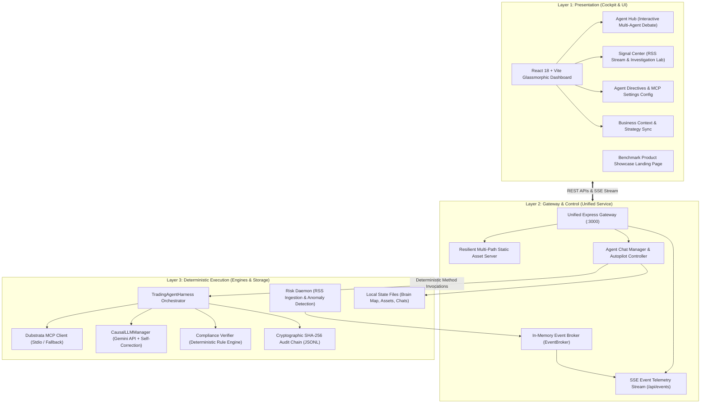
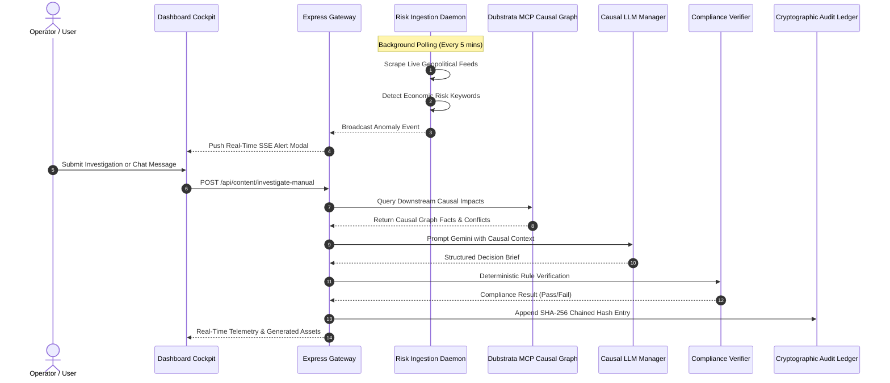

# 🏛️ Dubstrata Architectural Blueprint & Modernization Spec

## 1. Executive Summary
This blueprint defines the unified 3-layer target architecture for **Strata (Dubstrata Situation Monitor & Business Agent Hub)**. The system modernizes legacy trading and disparate script components into an autonomous, compliance-governed risk intelligence platform.

---

## 2. The 3-Layer Architectural Separation

---

## 3. Data Flow & Event Telemetry

---

## 4. Operational Persona Division (The 5 Subagents)

| Persona | Standard Operating Procedure | Primary Domain | Output Artifacts |
|---|---|---|---|
| **Visionary** | `SOP-STR-001` | Macroeconomic horizon mapping, SVAR loops, decoupling | Strategic Decision Briefs, OKRs |
| **Producer** | `SOP-OPS-004` | Sprint governance, engineering WIP limits, task queues | Sprint Backlogs, Work Breakdown |
| **Seller** | `SOP-SLS-001` | Institutional MEDDPICC qualification, API tiering | Discovery Docs, Deal Checkpoints |
| **Controller** | `SOP-FIN-001` | Solana x402 signatures, financial reconciliation, ASC 606 | Transaction Receipts, Schema Audits |
| **Systematiser** | `SOP-OPS-001` | Ingestion pipeline tuning, Muda elimination, Cypher graphs | Pipeline SOPs, Cypher Specs |

---

## 5. Modernization Milestones & Execution Checklist

- [x] **Milestone 1**: Forensic Audit (Inventorying all modules, data flows, and dead code).
- [x] **Milestone 2**: Architectural Blueprint (3-Layer model, telemetry sequence, component contracts).
- [ ] **Milestone 3**: Backend Unification & Resilience (Static path fallbacks, offline simulation guards, brain-map API).
- [ ] **Milestone 4**: Frontend Cockpit Integration (Verify build, purge dangling imports, streamline UX).
- [ ] **Milestone 5**: Negative Engineering (Pruning ~39MB scratch logs, deleting dead tab components, cleaning dist).
- [ ] **Milestone 6**: Boundary-First Diátaxis Docs (Tutorials, How-To, Reference, Explanation + Root README).
- [ ] **Milestone 7**: Product Showcase & Canonical Publishing (Raycast-grade benchmark landing page, link audit, git push).
