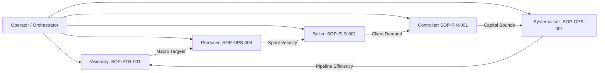

# 💡 Explanation: Multi-Agent Governance & SOP Alignment

This document details the multi-agent collaboration model, Standard Operating Procedure (SOP) boundaries, and the background Autopilot loop.

---

## 1. The Multi-Agent Philosophy
Unconstrained generalist AI models tend to hallucinate or drift when tasked with complex operational decision-making. Strata avoids this by enforcing **organizational role segregation**.

Instead of asking one model to plan strategy, write code, calculate financial reserves, qualify clients, and audit compliance simultaneously, Strata divides responsibilities among 5 specialist subagents guided by explicit Standard Operating Procedures:

---

## 2. Persona Responsibilities

### Visionary (`SOP-STR-001`)
- **Primary Focus**: Strategic horizon mapping, Structural Vector Autoregression (SVAR) impact loops, and macroeconomic decoupling.
- **Constraints**: Focuses on high-conviction directional strategies; leaves execution pacing to the Producer.

### Producer (`SOP-OPS-004`)
- **Primary Focus**: Engineering velocity, sprint task management, WIP limits, and pipeline bottlenecks.
- **Constraints**: Enforces Definition of Done (DoD) on code artifacts; validates latency limits.

### Seller (`SOP-SLS-001`)
- **Primary Focus**: Client qualification via MEDDPICC, B2B enterprise outreach, query API contract pricing.
- **Constraints**: Adheres to approved pricing schedules ($0.005/query, $0.020/report).

### Controller (`SOP-FIN-001`)
- **Primary Focus**: Financial ledger reconciliation, Solana x402 signature auditing, capital allocation controls.
- **Constraints**: Blocks any operation violating daily burn rates or unverified transaction receipts.

### Systematiser (`SOP-OPS-001`)
- **Primary Focus**: Lean operations, Muda waste elimination, ingestion pipeline architecture, Cypher graph schemas.
- **Constraints**: Eliminates redundant crawler passes and establishes reusable process loops.

---

## 3. The Server-Driven Autopilot Loop
When Autopilot is enabled in a discussion session:
1. The **Orchestrator** inspects the conversation history.
2. It evaluates which subagent is best positioned to address the immediate operational blocker or hypothesis.
3. The chosen subagent responds, consulting its SOP and relevant sandbox workspace files (`data/agents/`).
4. The server pauses for 3,000 milliseconds to simulate natural pacing and avoid rate-limit exhaustion.
5. Telemetry is streamed to all connected browsers via Server-Sent Events (`/api/events`).
6. The loop continues until the Orchestrator identifies an explicit decision point requiring the human **Operator**.
